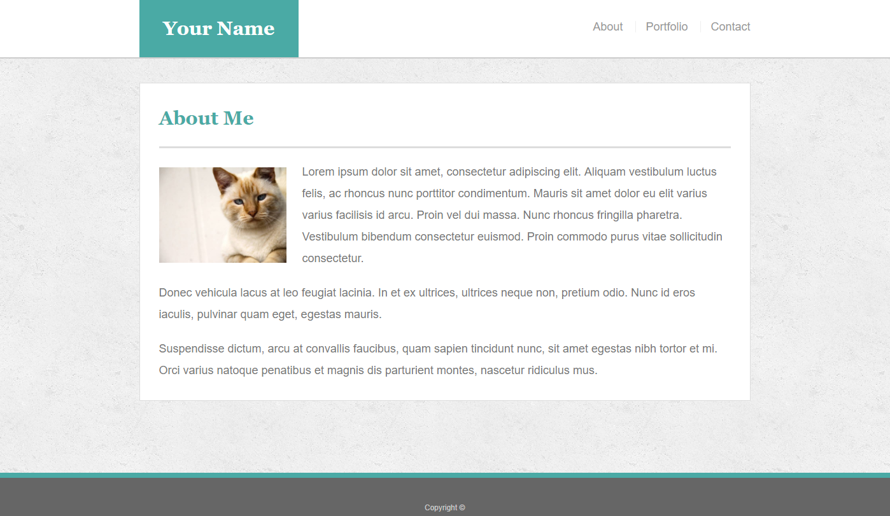

# Bootstrap-Portfolio-Redo

Part 1 of a 2 part follow up to the <a href="https://github.com/bksaechao/Basic-Portfolio-Redo">previous assignment</a>, but instead of building a portfolio with pure html/css, the first task is to re-create the same portfolio with the bootstrap css framework.

<ul>
  <li>
    <a href="https://bksaechao.github.io/Bootstrap-Portfolio-Redo/">Finished Project</a>
  </li>
  <li>
    <a href="https://bksaechao.github.io/Bootstrap-Portfolio/">Bootcamp Version</a>
    <ul>
      <li>
        <a href="https://github.com/bksaechao/Bootstrap-Portfolio">Github</a>
      </li>
    </ul>
  </li>
 </ul>

## Project Details & Requirements
<ul>
<li>
<strong>Re-create the previous portfolio assignment with Bootstrap.</strong>
</li>
</ul>

### *(Follow up notes)*
<ul>
  <li>
    Much cleaner and efficient code!
  </li>
  <li>
    Design was much closer to the homework assignment than my previous attempt
  </li>
  <li>
    Understood and felt significantly more confident about the assignment this time around!
  </li>
</ul>
